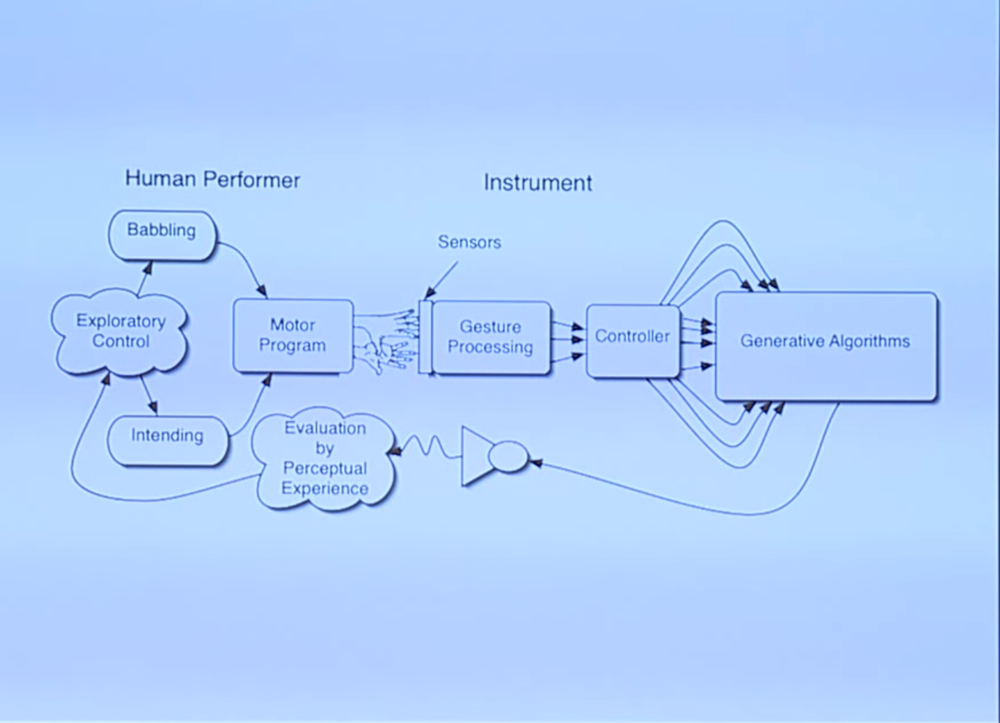

* Guest: Luisa Pereira
* Instrument Design
	* Expressivity
	* Responsiveness
	* Mapping
* Speakers and Amplification
	* Mixers
	* A/D & D/A Converters
	* Microphones
	* Speakers
* Misc JS
	* Javascript Inheritance
	* `bind`, `apply`, `call`


## Musical Interfaces

### Acoustic vs Electric

#### Acoustic Interfaces

* Sound source and interface are the same. 
* Fixed mapping. 
* Haptic Feedback. 

#### Electronic Instruments

* Sound and interface are seperated by Mapping
* No built in feedback. 
* Indirect / Abstract mapping possible. 

### Purpose / Context

The purpose / context of the interface is extremely important. 

* Is the user an expert of amateur?
* What sort of music is created with the instrument?
* How might an interface for composition be different than an instrument for improvisation?
* Ergonomics?
* Relationship between performer and audience. 
	* This is something that we talk about a lot, especially pertaining to interactive music which might not have an audience. 

## Interaction Model

The interaction model is how people use the interface and how it responds to them (and importantly, how they respond back to it responding). Feedback!

### Basic Interaction Model


### Improvisatory Interaction Model



### Performative Interaction Model

The above models, but add in another feedback loop in which the audience listening affects the performer. 

### Feedback / Feedforward

Helps articulating control. 
Active Engagement. 
Clarity of intent.

## Mappings

* Complexity / Transparency
* Feedback

* Complexity to stimulate creativity
* Transparency to keep link between input and resulting
sound (otherwise, danger of loosing the audience) 

#### One to One

Each gesture / input is mapped directly to one output. Clear and simple. Not terribly exciting. 

#### One to Many

One input controls multiple outputs. Higher level control but less control over details. Powerful. 

#### Many to One

Many inputs coupled to produce one musical parameter. Allows for greater expressive control and mastery. Finer degree of control. 

### Levels of indeterminancy

* Control vs. randomness (interactive improvisation)
* Total predeterminancy: push play -> deterministic output. 
* Total undeterminancy: random machines. 

### Continuous vs. discrete control 


* Micro- to macro-level control: sound spectrum to details of
articulation to overall structure

### Instruments

[The Hands - Michel Waisvisz](https://www.youtube.com/watch?v=U1L-mVGqug4)

Ergonomic controller

[Global String by Atau Tanaka (2000)](https://vimeo.com/46800992)

connected via the Internet. real time sound synthesis.

[Princeton Laptop Orchestra](https://www.youtube.com/watch?v=gOsaANAfZcw)

[Musical Jean Jacket](http://web.media.mit.edu/~strickon/projects.html)

[Keith McMillen - K-Bow](http://www.keithmcmillen.com/products/k-bow/)

[Jazzmutant - LEMUR](https://www.youtube.com/watch?v=X_BMnwIbWJw)

[Radio Baton - Max Matthews](https://www.youtube.com/watch?v=3ZOzUVD4oLg&feature=youtu.be&t=6m16s)

[Blendie - Kelly Dobson's sitet](https://www.youtube.com/watch?v=6DDkwdPaYmk)

## A/D & D/A

### D/A

Convert the digital audio signals inside your computer to an analog signal. 


### A/D

Takes analog signal from a microphone or instrument and samples it into a digital signal. 

#### Sampling Rate

Any sampling rate above CD Quality (44.1k) is sufficient for the majority of audio applications. Remember that bit depth plays a much bigger role in signal-to-noise ratio than the sampling rate. Very high sampling rates such as 96k or 192k are useful only in a handful of cases such as when you need to be able to slow the audio down significantly or for certain audio processing plugins. 

### Audio Interface

An audio interface (somtimes called a Sound Card) is an important piece of equipment to understand for doing audio I/O for a concert, installation or instruments. The job of an audio interface is ADC and DAC. 

A typically audio interface will have at least 2 outputs. Many have up up to 16 or more. These are the outputs which you connect to your speakers

### Speakers

Speakers come in a range of sizes and types. The primary metric of speakers is their cone-size which is proportional to the frequency they can produce. Larger cones can produce lower frequencies. 

#### Active

Active speakers are very easy to work with. They are self powered (i.e. have an "on" switch in the back) and have their own volume know typically. 

#### Passive

Passive speakers have no built in amplifier and require a powered amplifier for them to make any sound. They are much less expensive than Active speakers. 

### Microphone

Microphones are defined by their transducer type (dynamic, condenser) and their directional pattern (cardioid, omni, shotgun). 

A dynamic microphone will only pick up signal which is very close to it. This is useful for loud and live situations to avoid feedback. 

If working with microphones and amplification, it's important to match the type and directional pattern of the microphones to the placement and gain of the speakers. 

## Javascript!

### Inheritance

The way to do inheritance in javascript is through the prototype. The concept is to have the prototype of the child also refer to the parent (that you want to inherit from). When a method or attribute is not available in the child, it will look up the prototype chain to the parent. 

```javascript
Child.prototype = new Parent();.
//and remember to set the constructor back to the Child
Child.prototype.constructor = Child;
```

The problem is that the above example can have hidden side effects. What if the `Parent` constructor adds some elements to the DOM or console logs some things? Using this inheritance technique, those actions would happen prematurely, before you intend to actually construct the object. 

Here is an example of an extend method without side effects

```javascript
function extend(Child, Parent){
	function TempConstructor(){}
	TempConstructor.prototype = Parent.prototype;
	Child.prototype = new TempConstructor();
	Child.prototype.constructor = Child;
}
```

### `bind`, `call`, `apply`

`bind`, `call`, and `apply` all fall under the category of context (s)witchery. These are used in situations where you want apply a different context. 

#### `bind`

`bind` comes up the most often. The problem that `bind` solves is that you want to create a callback (say using jquery on a mouse event). The callback, by its very nature, is going to be invoked in a different context than you made it in, so how do you make sure the value of `this` is the one you want it to be? `bind`. 

`bind` takes a function and returns that function with the context bound to the function. 

```javascript
var MyClass = function(){
	//listen for mouse events using jquery
	$("#element").on("mousedown", this.onmousedown.bind(this));
}

MyClass.prototype.onmousedown = function(event){
	console.log("i was invoked with the correct context");
}
```

bind is not just about setting the context, you can also preset the arguments which will be invoked with the function. 

```javascript
function printToTheConsole(stuff){
	console.log(stuff);
}

var alwaysPrintHi = printToTheConsole.bind(window, "HELLO!");

alwaysPrintHi(); //prints "HELLO!"

```

#### `call`

`call` is like bind in that it applies a context to a function, but `call` invokes that function right away instead of returning a function like `bind` does. 

`call` is useful for "stealing" methods from other classes. 

```javascript
//here is a basic class
var AClass = function(){
	this.name = "Henry";
}

AClass.prototype.greeting = function(){
	console.log("hi my name is "+this.name);
};

//here is another class
var AnotherClass = function(){
	this.name = "Harriet";	
}

var anInstance = new AClass();
var anotherInstance = new AnotherClass();

//say the greeting
anInstance.greeting(); //prints "hi my name is Henry"
//use anInstance's greeting method with anotherInstances's data
anInstance.greeting.call(anotherInstance); //prints "hi my name is Harriet"
```

## In Class

Think carefully about what you believe to be a "natural mapping" (like force to dynamics). Pair up and make a list of illogical mappings, ones that you don't think make sense or feel natural. What doesn't work?

## REFERENCES

[Designing musical instruments that privilege improvisation - David Wessel](https://www.youtube.com/watch?v=uGASpqTXz4g)
[Design choices for computer instruments and computer compositional tools - Miller Puckette](https://www.youtube.com/watch?v=ZLACjtOpe0Q)
[Problems and Prospects for Intimate Musical Control of Computers - David Wessel, Matt Wright](http://xenia.media.mit.edu/~mbb/bid_www_class/readings/wessel.pdf)
[Composing Instruments: Inventing and Performing with Generative Computer-based Instruments - Ali Momeni](http://alimomeni.net/files/documents/ali-momeni-dissertation.pdf)
[Interfacing with sound; Design of music controllers - Washington State Univ.](http://courses.cs.washington.edu/courses/cse481i/14wi/pdfs/Q-interfaces.pdf)
[Principles for Designing Computer Music Controllers - Perry Cook](http://soundlab.cs.princeton.edu/publications/prc_chi2001.pdf)