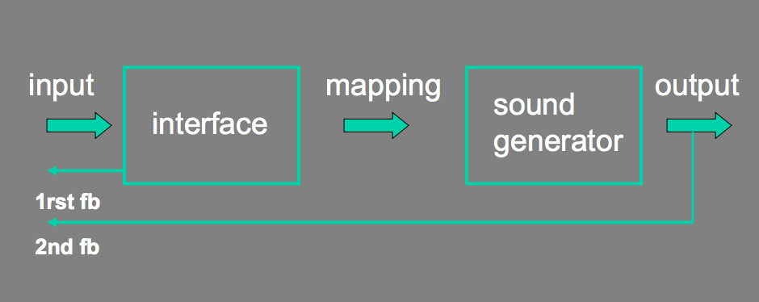

* Instrument Design
	* Expressiveness
	* Responsiveness
	* Mapping
	* Gesture
* Framing Interaction
	* Improvisation
		* Baroque
		* Raga
		* Jazz
		* Drum Circle
		* Free Improvisation
	* Prepared instruments
	* Silent-film Music
* Dimensionality
	* Conceptual Clarity
* Paper Prototyping Musical Interaction

## Class Survey

We're a little more than halfway through the semester. Please take a minute to fill out [this short survey](http://goo.gl/forms/6rRpWkulzL) to help make the best of the second half of the semester. 

## Office Hours 

Monday 3/28 3-6p

## Musical Interfaces

### Acoustic vs Electric

#### Acoustic Interfaces

* Sound source and interface are the same. 
* Fixed mapping. 
* Haptic Feedback. 

#### Electronic Instruments

* Sound and interface are separated by Mapping
* No built in feedback. 
* Indirect / Abstract mapping possible. 

### Purpose / Context

The purpose / context of the interface is extremely important. 

* Is the user an expert of amateur?
* What sort of music is created with the instrument?
* How might an interface for composition be different than an instrument for improvisation?
* Ergonomics?
* Relationship between performer and audience. 
	* Is it clear what the performer is doing? How she is manipulating sound?
	* How does this change in the context of interactive music which might not have the same notion of audience?

## Interaction Model

The interaction model is how people use the interface and how it responds to them (and importantly, how they respond back to it responding). Feedback!

### Basic Interaction Model

### Improvisatory Interaction Model

### Performative Interaction Model

The above models, but add in another feedback loop in which the audience listening affects the performer. 

### Feedback / Feedforward

Helps articulating control. 
Active Engagement. 
Clarity of intent.

## Mappings

### Complexity / Transparency

An entirely transparent 

* Feedback
* Complexity to stimulate creativity
* Transparency to keep link between input and resulting
sound (otherwise, danger of loosing the audience) 

#### One to One

Each gesture / input is mapped directly to one output. Clear and simple. Not terribly exciting. 

#### One to Many

One input controls multiple outputs. Higher level control but less control over details. Powerful. 

#### Many to One

Many inputs coupled to produce one musical parameter. Allows for greater expressive control and mastery. Finer degree of control. (e.g. Frequency and Detune knob). 

### Levels of indeterminacy

* Control vs. randomness (interactive improvisation)
* Total pre-determinacy: push play -> deterministic output. 
* Total indeterminacy: random machines. 

### Continuous vs. discrete control 

* Micro- to macro-level control: sound spectrum to details of
articulation to overall structure

### Instruments

Ergonomic controller: [The Hands - Michel Waisvisz](https://www.youtube.com/watch?v=U1L-mVGqug4)

[Global String by Atau Tanaka (2000)](https://vimeo.com/46800992) connected via the Internet. real time sound synthesis.

[Princeton Laptop Orchestra](https://www.youtube.com/watch?v=gOsaANAfZcw)

[Keith McMillen - K-Bow](http://www.keithmcmillen.com/products/k-bow/)

[Jazzmutant - LEMUR](https://www.youtube.com/watch?v=X_BMnwIbWJw)

[Radio Baton - Max Matthews](https://www.youtube.com/watch?v=3ZOzUVD4oLg&feature=youtu.be&t=6m16s)

[Blendie - Kelly Dobson's sitet](https://www.youtube.com/watch?v=6DDkwdPaYmk)

## Improvisation

Composing for improvisation is one way to frame writing music for interaction. You create the framework over which your listeners can explore and create over.

There is nearly always a "vocabulary" to improvisation - a style of playing which fits within the context/genre of the piece.

### Baroque / Early Music

Musicians and signers in the Baroque and Renaissance period improvised ornamentation, chord progressions, melodies, and harmonies. Keyboard players improvised entire pieces. 

During the Baroque period, common styles of ornamentation and voice leading become more codified and fixed into compositions. 

[Baroque-style improvisation](https://www.youtube.com/watch?v=KycMwdw4C6M)

### Raga

> A raga uses a series of five to nine musical notes upon which a melody is constructed. The way the notes are approached and rendered in musical phrases and the mood they convey are more important in defining a raga than the notes themselves.

[Raga Explanation Video](https://www.youtube.com/watch?v=5bFzS6upIW4)

### Western Improvisation Form

Head - Solos - (Recap of the Head) - Solos - Head - (Out)

[Cosmos Taking Solos](https://www.youtube.com/watch?v=HOh6qG4iT48)

### Jazz

Jazz Improvisation usually refers to improvising a set of notes over certain harmonies. The "chart" outlines the "head" melody and the accompanying chords. After playing through once or twice, the ensemble would then create new melodies over the given harmonies. 

[Thelonious Monk - Round Midnight](https://www.youtube.com/watch?v=IKayR1oqC7w)

#### Free Improvisation

Improvised music not constrained to given harmonies/melodies.

[Cecil Taylor - Free Improvisation #3](https://www.youtube.com/watch?v=EstPgi4eMe4)

### Dance-drumming

A key component to all of these forms is understanding what the "language" of the music is and being able to play within that. Certain things are allowed and others are not.

[Finding room for improvisation in West African Dance-drumming](http://www.artistshousemusic.org/videos/improvisation+in+ghanaian+music)

[Kpanlogo](https://www.youtube.com/watch?v=MGZ9rDoMEs4)

### Gamelan

> Javanese performers have the freedom to "develop" a theme, to edit a piece, to drastically vary the tempo and dynamics...

> There are many Javanese terms that may be translated loosely as improvisation: kembangan (literally "flowering"), improvisation that adds beauty; isen-isen ("filling"), improvisation that pleasantly fills a vacuum; ngambang ("floating"), improvisation produced by musicians who do not have a clear knowledge of where the music is going; sambang-rapet ("making a tight connection"), covering up a fellow performer's mistake in order to save him or her from embarrassment; and finally, ngawur ("blunder"), an out-of-style or irrelevant improvisation.

> [reference](http://www.gamelan.org/library/susiloessay.html)

[Gending Musik Jawa (Gamelan Jawa)](https://www.youtube.com/watch?v=wwjXwEO8_NU)

### Drum Circle

> In 1991, during testimony before the United States Senate Special Committee on Aging, Grateful Dead drummer Mickey Hart stated:

> Typically, people gather to drum in drum "circles" with others from the surrounding community. The drum circle offers equality because there is no head or tail. It includes people of all ages. The main objective is to share rhythm and get in tune with each other and themselves. To form a group consciousness. To entrain and resonate. By entrainment, I mean that a new voice, a collective voice, emerges from the group as they drum together.

Community vs Conducted?

## Prepared Instruments

[Cage Sonata for Prepared Piano](https://www.youtube.com/watch?v=pUTXNxFvjDw)

[La Monte Young - Well Tuned Piano](https://www.youtube.com/watch?v=pRlfFsbS7UM)

[Playing the Building - David Byrne](https://www.youtube.com/watch?v=Gea9SYUdJeY)

## [Photoplay](https://en.wikipedia.org/wiki/Photoplay_music)

The metaphor here is that the music follows and enhances something else which is going on. The "composed" system is about mirroring interaction which is intended for something else. 

[Chrome Music Lab Kandinsky](https://musiclab.chromeexperiments.com/Kandinsky)

[Le voyage dans la lune](https://www.youtube.com/watch?v=lUAD4lKNDI8)

## Dimensionality

The basic idea is to try to reduce the number of dimensions of interaction of your music to the fewest, but most powerful and expressive dimensions. 

### Conceptual Clarity

Back in the day of notated music, scores were another way a composer had to elucidate the underlying concepts of his/her piece. Ideas that may or may not have been obvious by just listening to the music. 

Looking at a [Twelve Tone Technique](http://en.wikipedia.org/wiki/Twelve-tone_technique) it's much easier to pick out the prime, retrograde, inversion, etc, than it is to hear those things in the music. [Schoenberg - Opus 23](https://www.youtube.com/watch?v=7A9HSlgDlQE)

The field of Musicology and Music Theory rely around this ability to identify, name, and reason about concepts and ideas that are preset in the score. 

But what about music which is composed/produced with a DAW or through software? How can we discover and reason about the composer's concept? Not having the ability to abstract musical concepts with something visual is like not having a word to describe an idea: we can circumlocute a concept, but we would get much further in our description and development of that idea if we had a word for it.

### Cohesion with Visual Music

How do sounds interact with visuals? 

How do you create cohesion between color/sound/form/movement/concept?

[Ligeti - Artikulation](https://www.youtube.com/watch?v=71hNl_skTZQ)

[Synchromy - Norm McLaren](https://www.youtube.com/watch?v=UmSzc8mBJCM)

[Dots - Norm McLaren](https://www.youtube.com/watch?v=E3-vsKwQ0Cg)

[Matrix III - John Whitney](https://www.youtube.com/watch?v=ZrKgyY5aDvA)

What is an intuitive mapping between sound and visuals? 

Music exists in time, so perhaps clear mappings have to do more with movement and gesture (Spectromorphology) than with shape and color.

### Conceptual Clarity / Cohesion with Interactive Music

[BubbleHarp](https://www.youtube.com/watch?v=ly8tgaswRo8)

[OscilloScoop - Scott Snibbe Studio](https://www.youtube.com/watch?v=ymW-_RENMKY)

[n - Drexler](http://www.wakeapp.com/n/en/)

[Thicket - Morgan Packard & Josh Ott](https://www.youtube.com/watch?v=4Xr9ELZSOnc)

## Paper Prototypes

Groups of 3 or 4. Design a musical interaction and mock up a paper prototype. 

* Introduction which explains the mapping/metaphor
* Exposition
* Ending

## References

[Designing musical instruments that privilege improvisation - David Wessel](https://www.youtube.com/watch?v=uGASpqTXz4g)

[Design choices for computer instruments and computer compositional tools - Miller Puckette](https://www.youtube.com/watch?v=ZLACjtOpe0Q)

[Problems and Prospects for Intimate Musical Control of Computers - David Wessel, Matt Wright](http://xenia.media.mit.edu/~mbb/bid_www_class/readings/wessel.pdf)

[Composing Instruments: Inventing and Performing with Generative Computer-based Instruments - Ali Momeni](http://alimomeni.net/files/documents/ali-momeni-dissertation.pdf)

[Interfacing with sound; Design of music controllers - Washington State Univ.](http://courses.cs.washington.edu/courses/cse481i/14wi/pdfs/Q-interfaces.pdf)

[Principles for Designing Computer Music Controllers - Perry Cook](http://soundlab.cs.princeton.edu/publications/prc_chi2001.pdf)

[Jazz Theory Book - Mark Levine](http://www.amazon.com/Jazz-Theory-Book-Mark-Levine/dp/1883217040)

